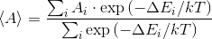
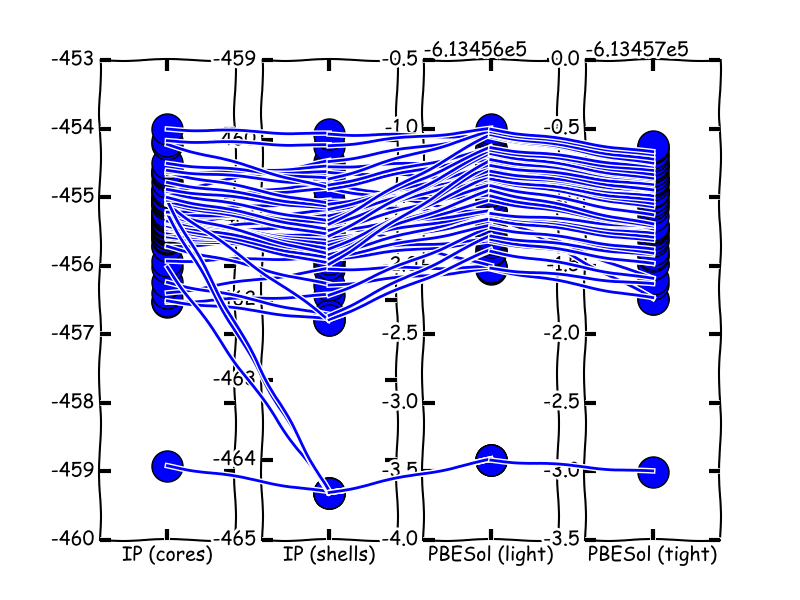

# Simulations Analysis Tool Kit
# Author: Tomas Lazauskas, 2015-2017
# www.lazauskas.net

A set of scripts to pre/post-process data for/from FHI-aims/GULP/KLMC simulations.

## Requirements 
Python v.2.7.x (x => 9)

Matplotlib v.1.x (x => 5.0)

numpy v.1.x (x => 10.1)

ADUL v.2.0 (For DM_Surface_Energy)

## Data Analysis Scripts

### DA_Thermally_Averaged_Statistics
Calculates a thermally averaged statistical value of a property. 

Usage:

DA_Thermally_Averaged_Statistics.py [options] input_file

Options:
  -h, --help  show this help message and exit
  -t TEMPS    List of temperatures, separated by a comma (default t=293)
  -u          A flag to say whether the input file contains only unique
              values. Default = False

Summary:

Reads in a text file in csv format, where the first column is the energy and the second column is the property value that will be statistically averaged. If the parameter -u is set, then it is assumed that the file contains only unique energies and property values and a third column having values of occurrences is expected.

Formula:

<!---
\left \langle A \right \rangle = \frac{\sum_{i}A_{i} \cdot \exp{\left ( -\Delta E_{i} / kT \right )}}{\sum_{i} \exp{\left ( -\Delta E_{i} / kT \right )}}
-->

## Cluster Analysis Scripts

### DM_Surface_Energy 
Calculates cluster's surface energy. 

Reads in a structure from an xyz file, estimates the area of a cluster using a predefined radius and calculates cluster's surface energy using a provided bulk energy of one atom.

## KLMC Genetic Algorithm Analysis Scripts

### GA_Energy_Evolution 
Plots the energy evolution graph of the n lowest energy structures during a KLMC GA simulation.

### GA_Energy_Histogram 
Plots energy distribution histogram from the last iteration of a KLMC GA simulation.

### GA_Family_Tree 
Finds parents, grandparents, etc for a specific GA iteration.

### GA_GM_Iter
Finds the GA iteration number on which the GM has been found.

## UNOSORTED

### DM_DOS
Plots DOS (and integrated DOS) graphs [Based on the David Mora Fonz's (UCL) implementation].

### DM_FHIaims_analysis 
Analyses FHI-aims simulations in terms of runtime, systems' energies etc.

### DM_FHIaims_Spin_Analysis 
Prepares and executes FHIaims spin polarized simulations. 

Reads in structures in xyz format, prepares geometry.in and control.in files by varying the default_initial_moment keyword. The script can also run the prepared simulations one by one. 

### DM_RDF
Plots radial distribution function.

### DA_Find_Defects
(Being developed) Analyses the change in a system by comparing two xyz files: initial and final configurations.

### DA_FHIaims_geometry_stability
(Being developed) Analyses a geometry with FHIaims - pushes a system in the direction of a chosen eigenvector and performs FHIaims single point evaluation.

### DM_Comparison 
(Being developed) Compares structures in terms of their energy ranking between different levels of theory (IPs (GULP) and DFT (FHIaims))

### DM_Convert_Files 
Converts files from one format to another. Works with the most popular formats, such us XYZ, CAR, and GIN.

### DM_Coordination_Bonding 
Analyses systems (xyz format) in terms of avg. bond distance and coordination.

