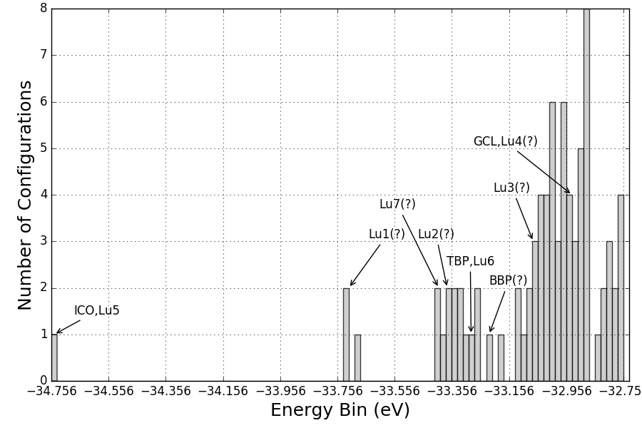

# KLMC Analysis Tool Kit
# Author: Tomas Lazauskas, 2015-2016
# www: www.lazauskas.net

A set of scripts to pre/post-process data for/from KLMC simulations.

# Requirements 
Python v.2.7.x (x => 9)

Matplotlib v.1.x (x => 5.0)

numpy v.1.x (x => 10.1)

# Scripts

### DM_Convert_Files 
Converts files from one format to another. Works with the most popular formats, such us XYZ, CAR, and GIN.

### DM_Coordination_Bonding 
Analyses systems (xyz format) in terms of avg. bond distance and coordination.

### DM_DOS
Plots DOS (and integrated DOS) graphs [Based on the David Mora Fonz's (UCL) implementation].

### DM_FHI_aims_analysis 
Analyses FHI-aims simulations in terms of runtime, systems' energies etc.

### DM_RDF
Plots radial distribution function.

### GA_Energy_Evolution 
Plots the energy evolution graph of the n lowest energy structures during a KLMC GA simulation.

### GA_Energy_Histogram 
Plots energy distribution histogram from the last iteration of a KLMC GA simulation.

### GA_Family_Tree 
Finds parents, grandparents, etc for a specific GA iteration.

### GA_GM_Iter
Finds the GA iteration number on which the GM has been found.